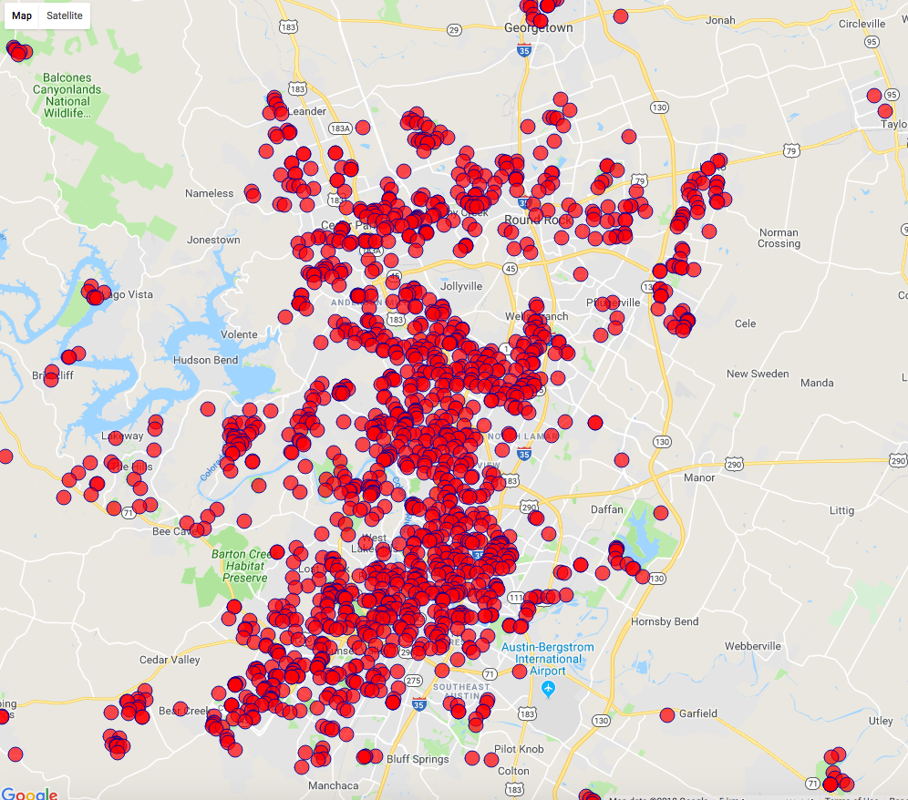

# 
 Final Project Proposal 

## 
  meets  

#### Summary
 My Capstone project researches the correlation between workout habits of the population of a few US cities as modeled by Strava segment data and real estate prices as aggregated by Zillow.

#### Background Research
 Several research studies have been done on the effect of proximity to parks and green spaces on real estate value. A few examples are listed below.

  - [Neighborhood parks and residential property values in Greenville, SC](https://ageconsearch.umn.edu/bitstream/15446/1/33030487.pdf)
  - [Property Prices and Urban Forest Amenities](http://digilib.itb.ac.id/files/JBPTITBCHE/disk1/49/jbptitbche-gdl-jou-2004-liisatyrva-2438-property-s.pdf)
  - [Assessing the Effect of Parks on Surrounding
Property Values Using Hedonic Models and
Multilevel Models](https://dc.uwm.edu/cgi/viewcontent.cgi?referer=https://www.google.com/&httpsredir=1&article=2296&context=etd)

    The main conclusion from these studies is that proximity to parks are mostly benefitial for real estate value. However, if     parks are too big or too busy, the effect can be negative. While I expect the presence of parks to be a factor in the         workout habits of the population I am studying, the question I hope to answer extends to an entire city, including the     population and real estate not close to parks. I hope to find something interesting after overlaying these sets of data

#### Usefulness

 The results of this project can be useful for
  - Strava: By leveraging the data they generate in a creative way outside their current business model, Strava can gain more business value.
  - Zillow: By including variables of workout habits in their datasets, Zillow can potentially augment existing models
  - City of Austin: The City of Austin can get insights into where to build new parks for the city

#### Presentation
 Presentation slides and D3 or Bokeh visualization given the time

#### Data Sources
 My data sources are Zillow, Strava API, Google geocoding API and US census bureau. After my first pass run, I have several thousand segment data points. I will store my data in a PostGres SQL database.

#### Potential Problems
 Potential problems are not getting enough data to draw a conclusion on my initial hypothesis. If I don't get enough data from Austin, I will consider running the analysis on a larger city.

#### What Next?
 I have already downloaded segment data from Strava and house price data from Zillow. I have created a few initial plots. See below - The plot indicates Strava running segments in Austin, TX. My next step is to merge these data and start analyzing them.

