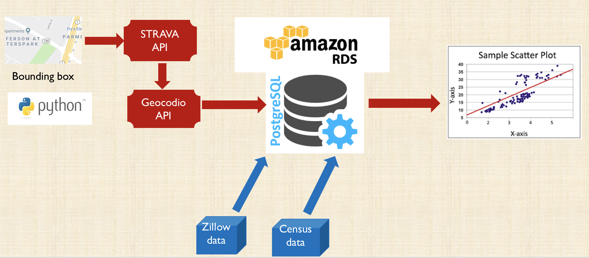
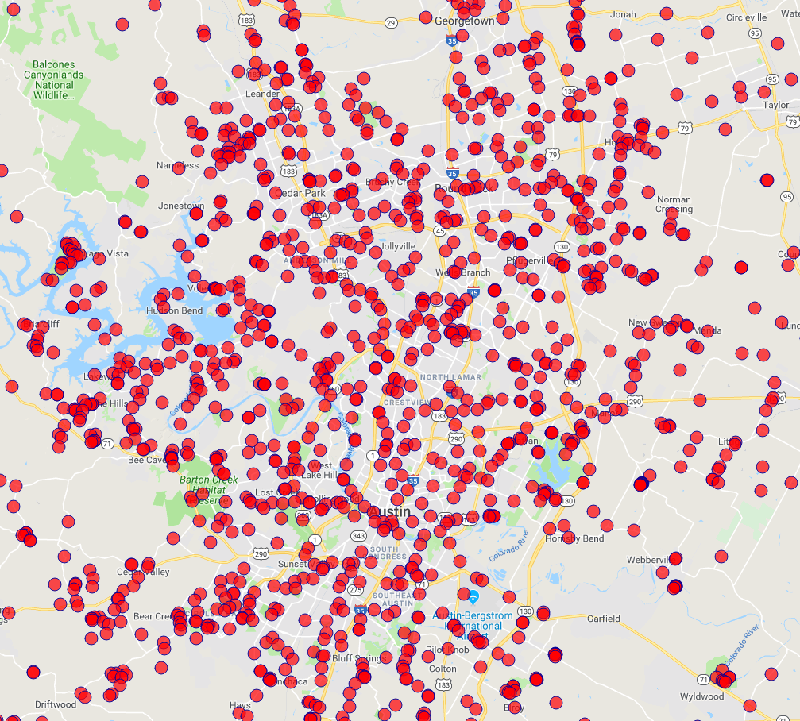

# 
  meets  

#### Summary
 My Capstone project researches the correlation between workout habits of a population as modeled by Strava segment data and real estate prices as aggregated by Zillow.

 Strava is a fitness app used by people to keep track of their running and biking activitiy. Strava users can create segments, which are sections in the user's path used to track improvement overtime and challenge other users. I will use segment concentration to quantify workout activity. Zillow is a real estate website. I will get information about median home prices by zipcode from Zillow.

#### Motivation

Predicting house prices is hard. It's a problem many are trying to solve in the multibillion dollar real estate industry. Recently Zillow setup a [Kaggle competition](https://www.kaggle.com/c/zillow-prize-1) which awarded $1,000,000 to the top person or team who could help improve it's zestimate home price metric. I hope to add to the conversation about potential predictors that can be used to improve accuracy of existing models.

My intuition going into this project is that there is a positive correlation between house prices and workout habits of a population.

#### Workflow
 

#### Strava API struggles
Strava's API return the top 10 segments within a boundary sent to the API. In order to get as many segments as possible, I split the city boundary into tiny sections. I used the code from

Author: Ryan Baumann's [athletedataviz](https://www.ryanbaumann.com/blog/2016/4/10/on-caching-how-advs-segments-works)

#### Segment concentration by type - Austin
Find below biking and running segment concentrations in Austin

  
