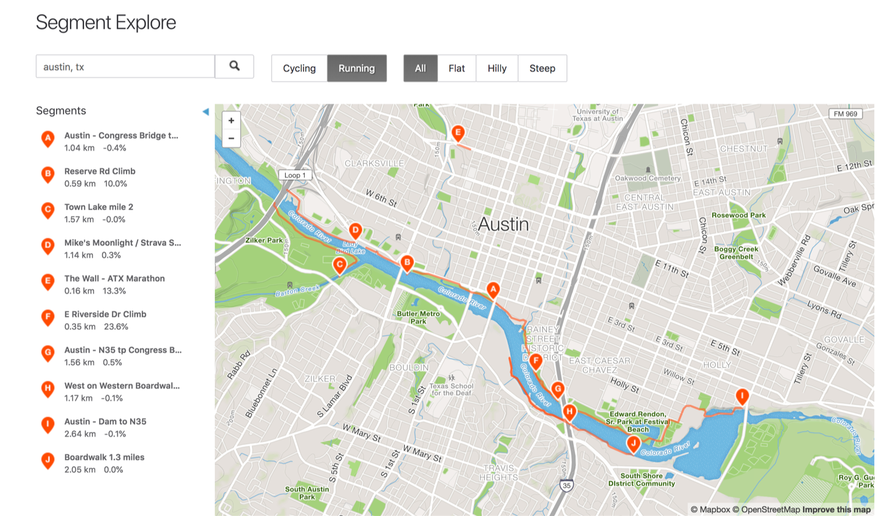
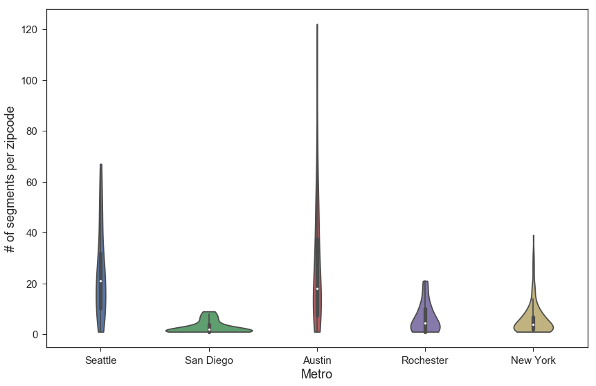
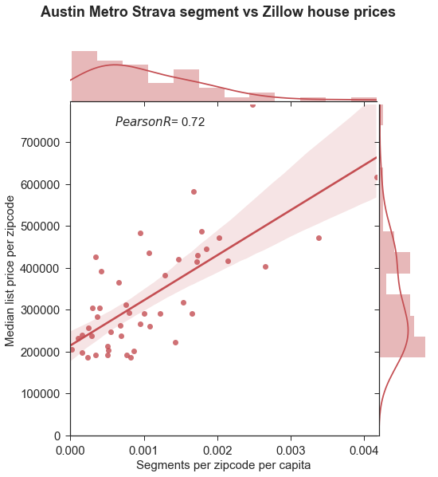
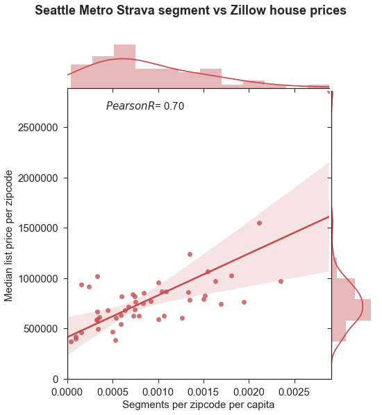
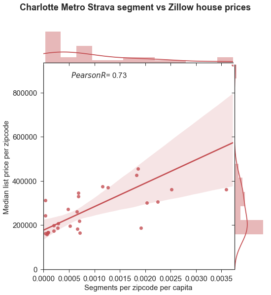
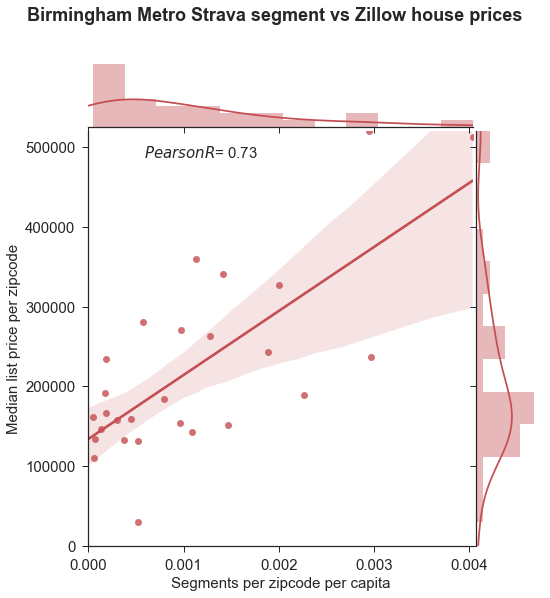

# 
  meets  

### Summary
 My Capstone project researches the correlation between workout habits of a population as modeled by Strava segment data and real estate prices as aggregated by Zillow.

 Strava is a fitness app used by people to keep track of their running and biking activitiy. A Strava user can create segments, which are sections in the user's path used to track improvement overtime and challenge other users. I will use segment concentration to quantify workout activity. Zillow is a real estate website. I will get information about median home prices by zipcode from Zillow.

#### Motivation

Predicting house prices is hard. It's a problem many are trying to solve in the multibillion dollar real estate industry. Recently Zillow setup a [Kaggle competition](https://www.kaggle.com/c/zillow-prize-1) which awarded $1,000,000 to the top person or team who could help improve it's zestimate home price metric. I hope to add to the conversation about potential predictors that can be used to improve accuracy of existing models.

My intuition going into this project is that there is a positive correlation between house prices and workout habits of a population.

#### Strava API challenges
Strava's API returns the top 10 segments within a boundary.

 

In order to get as many segments as possible, I split the city's bounding box into sub sections. I used the code from Ryan Baumann's atletedataviz project, varying split sizes during each run.

#### Segment concentration by type - Austin
Find below biking and running segment concentrations in Austin

Biking Segments             | Running Segments
:-------------------------:|:-------------------------:
  |  

From the plots, I can deduce that Strava users do not generally bike where they live, but they tend to run where they live. Therefore I used only running segments for my analysis.

#### Workflow
 
 
### Analysis

After collecting data from several cities, I realized that I did not have enough information about most of the cities to gain meaningful insights. For example, for many of the cities, I did not have enough segments per zipcode. See below plot of segments per zipcode for 5 cities. From this plot, the only 2 cities I kept are Austin and Seattle. The other cities had very few segments per zipcode as seen by the broad section of the violin plots

<figure>
<figcaption># of segments per zipcode by metro</figcaption>

</figure>

In the end, I analysed data from only 4 cities

- Austin
- Seattle
- Charlotte
- Birmingham

Find below the plots for these cities with X axis - Segments per zipcode per capita and Y axis - Median prices per zipcode. For these 4 cities, my correlation coefficients were in the 0.7 range indicating a positive correlation.

#### Next steps

- Collect more running data. Try other fitness apps
- Generate features on a more granular level for houses e.g
  - \# of runners within X miles
  - \# of segments within X miles
  - Distance to segments
- Add these features to existing home price prediction models and see if I get any improvement in predictions
- Investigate if workout activity can be a leading indicator in determining house prices

#### Repo structure

data --> zillow_median_price.csv - Zillow data with median home prices 
data --> zillow_median_sqft.csv - Zillow data with median home price per sqft 
data --> zillow_zhvi.csv - Zillow data with zhvi (Zillow median home price metric) which I used for my analysis 
data --> zipstats.csv - Census data with population per zipcode

src --> CityBounds.txt - File with hard coded city bounds I used for Strava API  
src --> EDA.ipynb - Jupyter notebook with EDA analysis 
src --> SQL_Queries.sql - SQL queries used to create database tables and search for data during analysis 
src --> Strava_Data_Collection.py - Python file to harvest Strava and Geocodio api data and save to PostgreSQL database on AWS 

images - Images used in README
